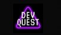

  

<h2 align='center'> First quest challenges - basic HTML/CSS of the frontend development course <a href="https://devemdobro.com/lista/">DevQuest</a></h2>

	

_Para a versão em Português, clique [aqui](#portuguese)._

### Topics

- [Exercises description](#exercises-description)

- [Technologies used](#technologies-used)

 

## Exercises description

### First exercise: Create two different paragraphs.

Apply the specifications in a way that makes it easy to maintain if more paragraphs are added in the future.

First paragraph: 

- Default style paragraph with background color #F5F5F5;
- External spacing of 40px;
- Internal spacing of 20px.

 

Segundo parágrafo: 

- Paragraph style highlighted with background color #F0CCE2;
- External spacing of 40px;
- Internal spacing of 20px.

 

### Second exercise: Create an image with an external link.

- This anchor must have an external link to the webe https://google.com;
- Use a placeholder image of size 200x300, using the website http://placeholder.com/.

 

### Third exercise: Stylized Table.

Make a clothing table with size and value described in each row, don't forget to add a header in each column.

- Background color of the 'fashion' header #BB86FC;
- Background color of the 'home' header #00C4B4;
- Background color of the table values #424250;
- Stylize using classes instead of HTML tags.

 

 

## Technologies used

  
  

 

  

<h2 align='center'> Desafios da primeira quest - HTML/CSS básico do curso de desenvolvimento frontend <a href="https://devemdobro.com/lista/">DevQuest</a></h2>

	

### Tópicos 

- [Descrição dos exercícios](#descrição-dos-exercícios)

- [Tecnologias utilizadas](#tecnologias-utilizadas)

 

## Descrição dos exercícios 

### Primeiro exercício: Criar dois parágrafos diferentes.

Aplique as especificações de maneira que facilite a manutenção caso mais parágrafos sejam adicionados no futuro.

Primeiro parágrafo: 

- Parágrafo de estilo padrão com a cor de fundo #F5F5F5;
- Espaçamento externo de 40px;
- Espaçamento interno de 20px.

 

Segundo parágrafo: 

- Parágrafo de estilo destacado com a cor de fundo #F0CCE2;
- Espaçamento externo de 40px;
- Espaçamento interno de 20px.

 

### Segundo exercício: Crie uma imagem com link externo.

- Essa âncora deve ter um link externo para o site https://google.com;
- Use uma imagem de placeholder de tamanho 200x300, usando o site o site http://placeholder.com/.

 

### Terceiro exercício: Tabela estilizada.

Faça uma tabela de roupas com tamanho e valor da peça descrito em cada linha, não esqueça de adicionar um cabeçalho em cada coluna.

- Cor de fundo do cabeçalho moda #BB86FC;
- Cor de fundo do cabeçalho casa #00C4B4;
- Cor de fundo dos valores da tabela #424250;
- Estilize utilizando classes ao invés das tags HTML.

 

## Tecnologias utilizadas

  
  

 

Developed with 🧡 by [me](https://www.linkedin.com/in/carolinebarbosavilar/)!
